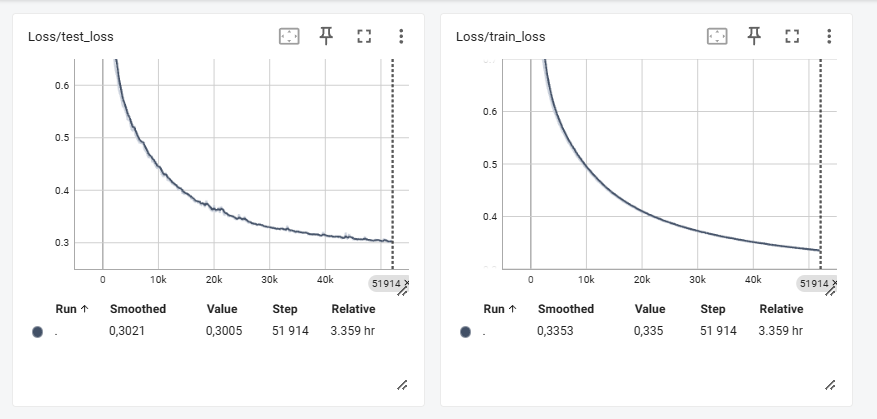

# Transformer-based Text-to-Speech (TTS) Model
Этот проект представляет собой реализацию модели Text-to-Speech (TTS) на основе архитектуры Transformer. Модель преобразует текстовые данные в аудио, генерируя спектрограммы, которые затем могут быть преобразованы в звук.
Конечно! Вот пример описания проекта для GitHub репозитория, основанный на предоставленном коде модели TTS (Text-to-Speech):

## Описание модели
Модель состоит из нескольких компонентов, включая:
### 1. **EncoderBlock**
Каждый блок кодировщика содержит слои нормализации, механизм самовнимания (Multihead Attention) и полносвязные слои с дропаутом. Эти блоки обрабатывают входные текстовые данные, чтобы извлечь значимые признаки.

### 2. **DecoderBlock**
Каждый блок декодера также содержит слои нормализации, механизм самовнимания и внимание к памяти (Memory Attention). Эти блоки используются для генерации спектрограмм на основе обработанных текстовых данных.

### 3. **EncoderPreNet**
Предобработка текстовых данных перед подачей в кодировщик. Включает эмбеддинги, сверточные слои и слои нормализации.

### 4. **DecoderPreNet**
Предобработка спектрограмм перед подачей в декодер. Включает полносвязные слои и дропаут.

### 5. **PostNet**
Постпроцессинг для улучшения качества генерируемых спектрограмм. Включает сверточные слои и слои нормализации.

### 6. **TransformerTTS**
Основной класс модели, который объединяет все вышеупомянутые компоненты. Он включает в себя:
- Позиционное кодирование для добавления информации о порядке данных.
- Несколько блоков кодировщика и декодера.
- Выходные слои для генерации спектрограмм и токенов остановки.

### Обучение
* Модель обучалась в `fp16`.
* Лосс функция была позаимствована из реалзиации [tacotron2](https://github.com/NVIDIA/tacotron2/blob/master/loss_function.py).

### Логи

Скачать `tensorboard логи` можно с [google drive](https://drive.google.com/file/d/1QY35qom_M47ZVP9AR88Hfbwu0K6P00H9/view?usp=sharing). В данной логах можно найти значения `train`, `test loss` + `generated audio example на каждой эпохе`.


### Результаты
По результатам обучения удалось добиться того, что можно разобрать фразу hello world, но есть проблемы со eos токеном(модель после сказанной фразы не хочет останавливаться).

### Запуск обучения
1. Клонирование репозитория + установка зависимостей
```
git clone ...
pip install pandas torch torchaudio 
```
2. Подгрузка данных
* Скачать данные [link](https://www.kaggle.com/datasets/mathurinache/the-lj-speech-dataset)

3. Настройка конфига config.yp
```
class Config:
    seed = 42
        
    csv_path = "data/metadatac.sv"
    wav_path = "set/your/path"
    save_path = "set/your/path"
    log_path = "set/your/path"
```

